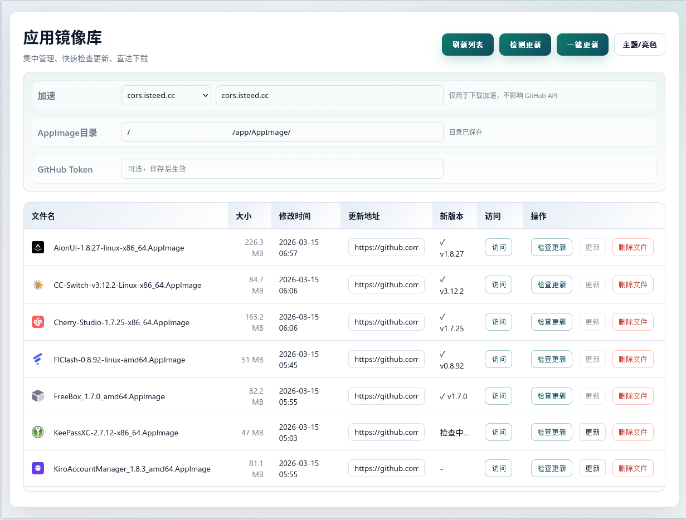

# AppImage 更新检查



这是一个本地 AppImage 管理页面，支持：
- 自动扫描指定目录 AppImage 文件
- 记录更新地址（GitHub Releases 或自定义直链）
- 检测更新、显示最新版本
- 一键更新（自动下载并替换文件）
- 镜像配置（用于下载）
- 主题切换、表格排序

## 运行方式

```bash
node app.js
```

然后访问：

```
http://localhost:18868
```

## 打包为单文件（pkg）

先安装 `pkg`：

```bash
npm i -g pkg
```

在项目目录下执行（默认生成与当前机器一致的架构；可手动指定）：

```bash
bash build.sh
```

然后运行生成的可执行文件：

```bash
./appimage-manager-linux-x64
```

如果你想手动指定架构：

```bash
ARCHES="x64" bash build.sh
ARCHES="x64 arm64" bash build.sh
```

说明：
- `app.html` 会被打进可执行文件中。
- 运行时仍会在当前目录读写 `app-update.json`、`config.json`，并扫描指定目录的 `.AppImage` 文件。

## 功能说明

- **刷新列表**：扫描指定目录下所有 `*.AppImage` 文件并展示。
- **更新地址**：
  - GitHub Releases：填写 `https://github.com/owner/repo/releases`
  - 非 GitHub：点击“更新”时弹出输入框填写直链 `.AppImage` 下载地址
- **检测更新**：只使用 GitHub 官方 API（不走镜像）。
- **更新**：下载最新 `.AppImage` 并替换旧文件（支持取消）。
- **保留旧版本**：更新时旧文件会改名为 `.old`，可在列表中点击“还原”恢复。
- **新版本**：显示最新版本号；若本地文件名已包含版本号，会显示 `✓` 小标记并禁用更新按钮。
- **排序**：表头点击可排序（文件名/大小/修改时间）。
- **缓存**：检测结果会在浏览器缓存 10 分钟，刷新页面不丢失。

## 镜像配置

页面顶部可设置镜像（下拉 + 输入框）：
- 下拉选择或手动输入
- **实时生效**：检测/更新请求会使用当前输入值
- 输入后会自动保存到 `config.json`，下次自动带出

下载时会走镜像，检测更新始终走 GitHub 官方。

## AppImage 目录

页面顶部可指定 AppImage 目录：
- 留空表示使用当前目录
- 支持相对路径或绝对路径
- 输入后会自动写入 `config.json`，并立即重新加载列表

## GitHub Token（可选）

若遇到 GitHub API 403，可配置 Token：

```bash
GITHUB_TOKEN=你的token node app.js
```

也可在页面顶部填写，自动写入 `config.json`。

小提示：当频繁请求或公开仓库被限流导致 403 时，可以配置 Token。

## 环境变量

- `PORT`：服务端口（默认 18868）
- `GITHUB_MIRROR`：默认镜像（可选，页面未设置镜像时使用）
- `GITHUB_TOKEN`：GitHub API 访问令牌（可选）

## 文件说明

- `app.js`：Node.js 服务端
- `app.html`：前端页面
- `app-update.json`：更新地址持久化文件（字段为 `updateUrl`）
- `config.json`：镜像 / Token / 目录配置（自动生成）

## 注意事项

- 仅支持指定目录下的 `.AppImage` 文件
- 更新会保留旧版本为 `.old`，可在页面点击“还原”恢复
- 取消更新不会影响旧文件
